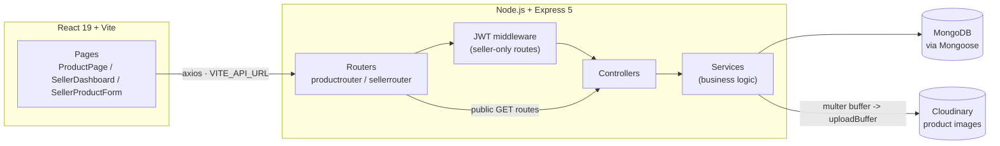

# 1Fi — Smartphones on EMI


A full-stack product page that lists smartphones with multiple EMI plans backed by mutual funds — built for the 1Fi SDE1 assignment. Product, variant, and EMI data is served from MongoDB via a REST API and rendered on a dynamic, per-product page.

**Live demo:** _add deployed link here_ · **Video walkthrough:** _add link here_

## Features

**Buyer**
- Landing page with a searchable/filterable catalogue (by name or brand)
- Live nav search — type in the navbar from any page, jump straight to a product
- Product detail page with variant (storage/color) switching and live price updates
- Selectable EMI plans — monthly amount, tenure, interest rate, cashback, a "0% interest only" filter, and a computed "best value" plan
- Net-cost breakdown per plan (total payable, cost after cashback, vs. paying today) — not just the monthly sticker number
- "Proceed with this plan" confirmation (toast, not a browser alert)
- Sticky mobile checkout bar so the CTA is reachable without scrolling back up
- Unique URL per product (`/products/:slug`)
- All data (products, variants, EMI plans) comes from MongoDB via the API — nothing is hardcoded in the frontend

**Seller**
- Seller registration/login (JWT, bcrypt-hashed passwords)
- Seller dashboard listing only that seller's own products
- Add a product with any number of variants, each with any number of EMI plans and its own uploaded image (Cloudinary — no manual URL pasting)
- Edit or delete a product — scoped to the owning seller (another seller's token can't touch it)
- Every seller-created product immediately shows up in the public buyer catalogue

A buyer never needs an account — browsing and "checkout" (the proceed step) are open. Only *adding/editing/deleting* a listing requires a seller account, which is why there's a separate seller auth layer instead of bolting write access onto the public API.

## Tech Stack

**Frontend** — React 19 + Vite, React Router v7, Tailwind CSS v4, Axios, lucide-react, js-cookie
**Backend** — Node.js + Express 5, JWT + bcrypt for seller auth, Multer + Cloudinary for seller-uploaded product images
**Database** — MongoDB + Mongoose

## Architecture



Each product document embeds its variants, and each variant embeds its own EMI plans — a single `find`/`findOne` returns everything a product page needs, no joins required. `router → controller → service → model` is a deliberately thin chain: controllers are pass-throughs (kept only so a route file never imports business logic directly), and `service/*.js` is where the actual logic and validation live.

## Schema

**Product**

| Field | Type | Notes |
|---|---|---|
| `slug` | String | unique, used in the product URL |
| `name` | String | |
| `brand` | String | |
| `category` | String | default `"Smartphones"` |
| `description` | String | |
| `variants` | [Variant] | embedded subdocuments |

**Variant** (embedded in `Product.variants`)

| Field | Type | Notes |
|---|---|---|
| `name` | String | e.g. `"256GB Cosmic Orange"` |
| `storage` | String | |
| `color` | String | |
| `swatch` | String | hex color used for the variant picker dot |
| `image` | String | image URL |
| `mrp` | Number | |
| `price` | Number | |
| `emiPlans` | [EmiPlan] | embedded subdocuments |

**EmiPlan** (embedded in `Variant.emiPlans`)

| Field | Type | Notes |
|---|---|---|
| `tenure` | Number | months |
| `interestRate` | Number | e.g. `0` or `10.5` |
| `monthlyPayment` | Number | |
| `cashback` | Number | `0` if none |

Seed data lives in [`Backend/seed/products.data.js`](Backend/seed/products.data.js) — 5 products (Apple iPhone 17 Pro, Samsung Galaxy S24 Ultra, Google Pixel 9 Pro XL, Nothing Phone (2), Xiaomi 14), 15 variants total, 7 EMI plans per variant. Product images are real photographs from Wikimedia Commons (freely licensed), not placeholders — the iPhone's 3 color variants each get their own photo; the rest vary by storage only, so they reuse one real photo per product (identical in real life regardless of storage tier).

**Seller**

| Field | Type | Notes |
|---|---|---|
| `email` | String | unique |
| `password` | String | bcrypt-hashed |
| `name` | String | |
| `businessName` | String | |
| `contact` | Number | |

`Product.sellerId` (ObjectId, ref `seller`) links a product to the seller who created it — `null` for the pre-seeded catalogue products. Ownership is enforced at the query level: `updateProduct`/`deleteProduct` match on `{ _id, sellerId }`, so a seller's JWT can never touch another seller's listing.

## Getting Started

### Prerequisites

- Node.js 18+
- A MongoDB connection string (Atlas or local)

### Backend

```bash
cd Backend
npm install
cp .env.example .env   # fill in MONGO_URI, JWT_SECRET, and CLOUD_NAME/API_KEY/API_SECRET (Cloudinary)
npm run seed            # populate the database with sample products
npm run dev              # http://localhost:5000
```

### Frontend

```bash
cd Frontend
npm install
cp .env.example .env   # VITE_API_URL=http://localhost:5000/api
npm run dev              # http://localhost:5173
```

To point the frontend at a different backend (e.g. after deploying), set `VITE_API_URL` in `.env` to the deployed backend's `/api` URL.

## Testing & CI

```bash
cd Backend
npm test
```

Runs on Node's built-in test runner (`node --test`, zero extra test-framework dependency) against an in-memory MongoDB ([`mongodb-memory-server`](https://github.com/typegoose/mongodb-memory-server)) — nothing touches the real database. Covers:

- `test/emi.test.js` — the EMI math itself: the 0%-interest tenures divide the MRP evenly, the interest-bearing tenures produce a real reducing-balance EMI (not a naive division) that decreases as tenure lengthens, and `emiPlansFor` always returns exactly 7 plans.
- `test/api.test.js` — the full HTTP surface: catalogue list/detail/404, that unknown routes return JSON (not Express's default HTML error page), and the entire seller lifecycle — register → validation rejects a weak password → login rejects a wrong password → add a product → it's live on the public catalogue → update it → **a second seller's token gets a 404 trying to touch it** → owner deletes it → it's gone from the public catalogue.

`.github/workflows/ci.yml` runs this test suite plus `Frontend`'s lint + build on every push/PR.

## API Endpoints

Base URL: `http://localhost:5000/api`

### `GET /api/products`

Returns every product (used for the catalogue strip).

```json
{
  "success": true,
  "products": [
    {
      "_id": "66f1a2b3c4d5e6f7a8b9c0d1",
      "slug": "iphone-17-pro",
      "name": "iPhone 17 Pro",
      "brand": "Apple",
      "category": "Smartphones",
      "description": "The most powerful iPhone yet...",
      "variants": [
        {
          "_id": "66f1a2b3c4d5e6f7a8b9c0d2",
          "name": "256GB Silver",
          "storage": "256GB",
          "color": "Silver",
          "swatch": "#e6e6ea",
          "image": "https://commons.wikimedia.org/wiki/Special:FilePath/Silver_iPhone_17_Pro_Max.jpg?width=640",
          "mrp": 134900,
          "price": 127400,
          "emiPlans": [ /* ... */ ]
        }
      ]
    },
    { "slug": "samsung-s24-ultra", "name": "Samsung Galaxy S24 Ultra", "...": "..." },
    { "slug": "google-pixel-9-pro-xl", "name": "Google Pixel 9 Pro XL", "...": "..." }
  ]
}
```

### `GET /api/products/:slug`

Returns one product with its full variant and EMI plan data.

`GET /api/products/iphone-17-pro`

```json
{
  "success": true,
  "product": {
    "_id": "66f1a2b3c4d5e6f7a8b9c0d1",
    "slug": "iphone-17-pro",
    "name": "iPhone 17 Pro",
    "brand": "Apple",
    "category": "Smartphones",
    "description": "The most powerful iPhone yet, built on the A19 Pro chip...",
    "variants": [
      {
        "_id": "66f1a2b3c4d5e6f7a8b9c0d2",
        "name": "256GB Silver",
        "storage": "256GB",
        "color": "Silver",
        "swatch": "#e6e6ea",
        "image": "https://commons.wikimedia.org/wiki/Special:FilePath/Silver_iPhone_17_Pro_Max.jpg?width=640",
        "mrp": 134900,
        "price": 127400,
        "emiPlans": [
          { "_id": "...", "tenure": 3, "interestRate": 0, "monthlyPayment": 44967, "cashback": 7500 },
          { "_id": "...", "tenure": 6, "interestRate": 0, "monthlyPayment": 22483, "cashback": 7500 },
          { "_id": "...", "tenure": 12, "interestRate": 0, "monthlyPayment": 11242, "cashback": 7500 },
          { "_id": "...", "tenure": 24, "interestRate": 0, "monthlyPayment": 5621, "cashback": 7500 },
          { "_id": "...", "tenure": 36, "interestRate": 10.5, "monthlyPayment": 4297, "cashback": 7500 },
          { "_id": "...", "tenure": 48, "interestRate": 10.5, "monthlyPayment": 3385, "cashback": 7500 },
          { "_id": "...", "tenure": 60, "interestRate": 10.5, "monthlyPayment": 2842, "cashback": 7500 }
        ]
      }
    ]
  }
}
```

`GET /api/products/does-not-exist` → `404 { "success": false, "msg": "product not found" }`

### Seller endpoints

All `/api/seller/*` routes (except register/login) require `Authorization: Bearer <token>`, obtained from `/api/sellerlogin`.

| Method | Route | Auth | Description |
|---|---|---|---|
| POST | `/api/sellerregister` | — | Create a seller account |
| POST | `/api/sellerlogin` | — | Returns `{ success, token }` |
| GET | `/api/sellerprofile` | ✓ | Current seller's profile |
| GET | `/api/sellerlogout` | ✓ | Clears the auth cookie |
| GET | `/api/seller/products` | ✓ | Products owned by the logged-in seller |
| POST | `/api/seller/products` | ✓ | Create a product (slug auto-generated from `name`) |
| PUT | `/api/seller/products/:id` | ✓ | Update a product you own |
| DELETE | `/api/seller/products/:id` | ✓ | Delete a product you own |
| POST | `/api/seller/upload-image` | ✓ | `multipart/form-data`, field `image` → uploads to Cloudinary, returns `{ success, url }` to drop into a variant's `image` field |

`POST /api/seller/products` body:

```json
{
  "name": "OnePlus 13",
  "brand": "OnePlus",
  "category": "Smartphones",
  "description": "Flagship killer.",
  "variants": [
    {
      "name": "256GB Black",
      "storage": "256GB",
      "color": "Black",
      "swatch": "#111111",
      "image": "https://...",
      "mrp": 69999,
      "price": 64999,
      "emiPlans": [
        { "tenure": 6, "interestRate": 0, "monthlyPayment": 11666, "cashback": 2000 }
      ]
    }
  ]
}
```

→ `201 { "success": true, "product": { ...with generated "slug": "oneplus-13" } }`. Trying to update/delete a product you don't own → `404 { "success": false, "msg": "product not found" }` (the query is scoped to `{ _id, sellerId }`, so it never leaks whether the product exists under someone else).

## Project Structure

```
1fi/
├── .github/workflows/ci.yml    # tests + lint + build on every push/PR
├── render.yaml                 # Render blueprint for the backend
├── Backend/
│   ├── app.js                  # builds the Express app (no listen()) - importable by tests
│   ├── index.js                # loads env, connects Mongo, calls app.listen()
│   ├── config/dbconnection.js
│   ├── model/product.js
│   ├── model/seller.js
│   ├── middleware/seller.js    # JWT auth
│   ├── middleware/multer.js    # memory storage, 5MB limit, images only
│   ├── config/cloudinary.js
│   ├── utils/emi.js            # EMI math (unit tested)
│   ├── service/productservice.js
│   ├── service/sellerservice.js
│   ├── controller/productcontroller.js
│   ├── controller/sellercontroller.js
│   ├── router/productrouter.js
│   ├── router/sellerrouter.js
│   ├── seed/products.data.js
│   ├── seed/seed.js
│   └── test/
│       ├── emi.test.js
│       └── api.test.js
└── Frontend/
    ├── vercel.json              # SPA rewrite so /products/:slug survives a refresh
    └── src/
        ├── App.jsx              # router
        ├── main.jsx
        ├── pages/
        │   ├── Home.jsx                 # landing page: hero, catalogue, how it works
        │   ├── ProductPage.jsx
        │   ├── SellerRegister.jsx
        │   ├── SellerLogin.jsx
        │   ├── SellerDashboard.jsx
        │   └── SellerProductForm.jsx   # shared add/edit form, uploads images directly
        └── components/
            ├── Navbar.jsx               # sticky nav with live product search
            ├── ProductCard.jsx
            ├── Footer.jsx
            └── SellerPrivateRoute.jsx
```

## Design Decisions

A few choices worth explaining rather than leaving implicit:

- **Embedded variants/EMI plans, not separate collections.** A product page needs every variant and every plan in one shot; embedding means one `findOne` instead of a join across 3 collections. The tradeoff (can't query "all EMI plans with 0% interest" across products efficiently) doesn't matter for this app's access pattern.
- **`router → controller → service → model`, with a thin controller layer.** The controller adds no logic of its own — it exists so a router file only ever imports a controller, never a service or model directly, keeping the dependency direction consistent even though it means an extra pass-through file per route group.
- **`app.js` / `index.js` split.** Building the Express app and starting the server were originally one file, which meant any test importing it would also try to open a real Mongo connection and bind a port. Splitting them (`app.js` exports the configured app; `index.js` wires up the DB connection and calls `.listen()`) is what makes `test/api.test.js` possible without touching Render or Atlas.
- **Seller auth is separate from "checkout."** A buyer never needs an account — the assignment's own reference flow is browse → pick a plan → proceed. Only *writing* to the catalogue (add/edit/delete a product) needed real access control, so that's where the JWT layer lives, scoped so a seller's token can only ever touch `{ _id, sellerId }` matches of their own.
- **Real photos over generated placeholders.** Early on the seed data used `placehold.co` colored boxes. Swapped to real Wikimedia Commons photos - and where a real photo only existed for one variant of a device (e.g. Pixel 9 Pro *XL*, not the plain Pro), renamed the product to match what's actually shown rather than mislabel it.

## Deployment

- **Backend → Render.** `render.yaml` at the repo root is a [Render Blueprint](https://render.com/docs/blueprint-spec) — "New +" → "Blueprint" → point it at this repo and Render reads the service definition automatically (root dir `Backend`, `npm install` / `npm start`, health check on `/healthz`). It'll prompt for the env vars it doesn't know: `MONGO_URI`, `JWT_SECRET`, `CLOUD_NAME`, `API_KEY`, `API_SECRET`. Run `npm run seed` once against the production `MONGO_URI` (locally, with `.env` pointed at prod, or via Render's shell) to populate it.
- **Frontend → Vercel.** Import the repo, set the root directory to `Frontend`, and add one env var: `VITE_API_URL` = the deployed backend's URL + `/api`. `vercel.json` handles the SPA rewrite so refreshing `/products/iphone-17-pro` doesn't 404.
